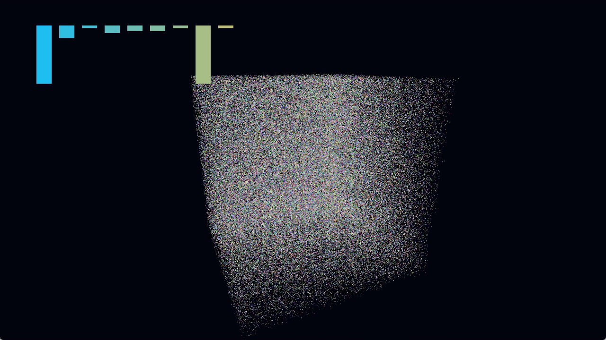

# Live streaming point-cloud showcase

For a labelled baseline/candidate view with independent timing evidence, see the [comparison video](StreamingComparison.md).

[Watch or download the full 50-second MP4](https://github.com/Yanagisawa2002/summit-gpu-systems/releases/download/streaming-point-cloud-showcase-2026-09-08/summit-streaming-point-cloud.mp4)

[](https://github.com/Yanagisawa2002/summit-gpu-systems/releases/download/streaming-point-cloud-showcase-2026-09-08/summit-streaming-point-cloud.mp4)

The video is an uninterrupted recording of the real Unity Release Player on
AMD Radeon AI PRO R9700, using D3D12. It shows a camera orbit around the procedural
point cloud, deterministic position updates, and actual AssetBundle content
registration/unregistration. The nine bars are driven directly by the nine GPU
query results. The fixture has 262,144 sample slots, including two streamed sets
of 16,384 slots; inactive samples are not drawn.

The opt-in `new-full` arm uses BatchedPointScanWave queries and a complete Direct
WaveOps index rebuild. Runtime package defaults are unchanged. For a legible
demonstration, the original 384 logical updates are scheduled across 45 seconds,
with a smooth wall-clock camera, preroll and an ending hold. The current live GPU
commands continue rendering between logical updates. This is **presentation-paced
live execution**, not replay of recorded images, not a before/after comparison,
and not a performance measurement. Native timing probes are disabled.

## Recording and validation

- Recorded source: `4196b7536a8e2b9c7e8cd1a4f467e7defa52f9ca`.
- MP4: H.264, 1280×720, 50.000 seconds, nominal 30 fps; no audio or cursor.
- The external recorder captures only the owned visible Player client rectangle.
  No desktop panels, application title bar, interpolation, time stretching,
  composited replacement scene, or performance overlays are added.
- All 384 logical frames / 3,840 query-and-metadata digest records match the
  original CPU oracle byte for byte. Real load/cancel/register/unregister/unload
  events and both successful process exits are retained.
- The full video decoded successfully, with no detected black segment. The
  beginning, middle and ending were visually reviewed. Encoding/capture rate is
  not an engine-frame performance guarantee.
- SHA256: `6dfc53d46b031cf06415fbcc1bc91e4aee4eccf4da354771ff4865ffe42de49a`.

The [release](https://github.com/Yanagisawa2002/summit-gpu-systems/releases/tag/streaming-point-cloud-showcase-2026-09-08)
includes the video, validation JSON, poster, and a capture evidence archive with
the original oracle, GPU history, result, exact recorder arguments, source/build
identity and SHA256 manifest. The large MP4 is a release asset rather than a Git
blob. Repository and third-party license terms remain unchanged.

## Reproduce

Use Unity 6000.5.2f1, Windows/D3D12, PowerShell 7 and ffmpeg. Extract
`capture-evidence.zip` from the release to a local directory. From the standalone
project directory, run:

```powershell
./Scripts/Build.ps1 -Unity 'C:/Program Files/Unity/Hub/Editor/6000.5.2f1/Editor/Unity.exe' -OutputRoot ./Artifacts/showcase-build
./Scripts/Record-Showcase.ps1 -BuildRoot ./Artifacts/showcase-build -OutputRoot ./Artifacts/showcase-capture -Oracle '<extracted evidence>/original-oracle.bin'
```

Use new output directories. Build and recording acquire the existing shared GPU
mutex separately. The recorder brings only its own Player window to the front
for about a minute, records its 1280×720 client area, verifies the complete
history, and closes its owned processes. No administrator permission or
PresentMon/WPR capture is used. Keep the recording unobscured. Historical absolute
paths in the evidence identify the collecting machine; they are not required
repository dependencies.
