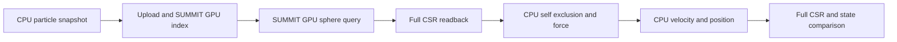

# SUMMIT query-to-physics attempt: platform gate stopped

**Outcome: SKIPPED. No GPU physics consumer was implemented or executed.**
The September 16 single-attempt task inspected refreshed main
`58ef769503d7bfe843d562155c9022fa31ef46ee`, then stopped at the existing-platform
gate. This change records the actual call chain and a bounded consumer contract;
it does not qualify a Linux backend or change runtime behavior.

## Observed platform gate

| Check | Observation | Meaning |
| --- | --- | --- |
| Assigned remote identity and exclusive lock | Identity matched; nonblocking `flock` acquired at 2026-09-15 18:18:02 UTC; read-only command exited 0 | Correct assigned machine was inspected; no experiment was launched |
| Remote system | Ubuntu 22.04.5, RTX 5090, driver 595.58.03; no reported GPU compute or project processes | Hardware was available at that instant; this is not noise calibration |
| Remote Unity runtime | No Unity command, known installation directory, or Linux Player in the bounded campaign search | No available Unity execution entry point was discovered; this was not a whole-disk search |
| Remote Vulkan | NVIDIA ICD file present; no `vulkaninfo` or `Xvfb` command discovered | A driver file does not prove a usable Unity graphics context; no dispatch was attempted |
| Local pinned editor | Unity 6000.5.2f1 present; only `windowsstandalonesupport` installed | The existing editor cannot supply an already-installed Linux build module |
| Local graphics | Intel Graphics and RTX 4090 enumerated | A local result would be separate from remote RTX 5090 evidence; no local device run occurred |
| Repository build | `StandaloneWindows64`, `Direct3D12`, `.exe` and `UnityPlayer.dll` receipts | The committed molecular build path is Windows-specific |
| Repository consumer | Only `legacy` and `reuse` arms accepted; both call scalar CPU `State.Consume` | No existing SUMMIT GPU force/update arm can be selected |

The raw [remote inventory](remote-preflight.txt), [local inventory](local-inventory.json),
and exact [source excerpts with hashes](source-map.json) support these observations.
[Preflight scope](preflight.json) records commands, search limits, outcomes and
unavailable metrics. Connection details and credentials remain in the local
queue; this public evidence identifies anonymous hardware only.

The assigned attempt permits stopping when the existing Unity/Linux route is
missing and excludes a new native backend. Continuing on this host would first
require platform enablement and device validation, as well as the missing GPU
consumer. No Unity/module/display installation, native CUDA/Vulkan rewrite,
external baseline rerun, or replacement local experiment was started. This is a
scope stop, not proof that Unity can never run on Linux or on this hardware.

## Current producer-to-consumer chain

All locations below refer to the audited base SHA. They are also captured as
verbatim numbered excerpts in `source-map.json`.

| Stage | Current code | Actual behavior |
| --- | --- | --- |
| Arm selection | `PublicBenchmarks/WholeTaskMolecularDynamics/Unity/MolecularPlayer.cs:139` | Rejects every arm except `legacy` and `reuse` |
| Point snapshot | Same file, lines 158-165 | Reuse uploads points, submits an index rebuild, and calls `CompleteIndexBuild` |
| SUMMIT index | `Packages/com.summit.gpu-sensor-pipeline/Runtime/GpuSensorFullRebuildIndex.cs:52-68` | Dispatches snapshot keys and the SUMMIT direct binner |
| Query batches | `MolecularPlayer.cs:167-184` | At most 128 spheres; SUMMIT count/scan/scatter followed by full offsets and IDs readback |
| Exact membership | `PublicBenchmarks/External/Adapters/Resources/SummitExternalSphere.compute:23-66` | Original float sphere predicate, inclusive boundary, original IDs |
| Self exclusion | `MolecularPlayer.cs:186-191` | CPU aggregation excludes only the original particle ID |
| Force and state | `MolecularPlayer.cs:195-199`; `MolecularContract.cs:80-110` | CPU arrays receive force, then velocity and position updates; full validation follows the timer |
| Build platform | `Unity/Editor/BuildMolecularPlayer.cs:19-26`; `Scripts/build_artifact.py:107-133`, relative to the molecular benchmark | Windows/D3D12 Player plus Windows product filenames |

The break is between the GPU query buffers and a GPU force consumer. Native
ArborX/CUDA numerical success does not fill this break. The existing query shader
contains count, offset-finalization and scatter kernels; no molecular force or
state-update kernel is present in that path.

## Bounded consumer interface contract — proposed, unimplemented

This is a review specification for a later authorized attempt, not a new public
API, executable recipe, or claim of tested source. Preserve the existing adapter
and one ordered graphics queue. A task-specific owner would need these operations:

| Proposed operation | Inputs and ownership | Required output / completion |
| --- | --- | --- |
| Upload snapshot | Immutable float positions/original IDs and velocities; require IDs to equal array indices for this benchmark | Separate device positions and velocity buffers; account for duplicate position upload because adapter positions are private |
| Record force batch | Adapter `Offsets`/`Ids`, `firstParticle`, `queryCount`, immutable positions | Write only force rows `[firstParticle, firstParticle + queryCount)`; exclude self by original ID; do not update positions yet |
| Record state update | Completed full force buffer and input positions/velocities | Apply the existing mass-1, timestep-0.005 velocity update and then position update; return a completion fence after both |
| Collect validation output | Completed consumer and audit storage | Full membership/multiplicity plus every finite force, velocity and position component; no count/checksum-only acceptance |
| Drain and dispose | Every submitted reader and pending readback | Wait for completion before replacing query buffers or releasing owners; unsubmitted commands must be discarded |

Required submission order:

1. Start the complete-task clock at the shared CPU snapshot. Upload consumer
   buffers and adapter points. Record/submit one index build and call
   `CompleteIndexBuild`; its eight-byte stamp readback stays inside the clock.
2. For each batch, upload queries, record `RecordQueries`, append force dispatch,
   then append an **application consumer fence**. Submit once.
3. Wait for that later fence before another immediate `UploadQueries`, point
   replacement, output reuse or disposal. The adapter fence precedes force and
   cannot certify the later reader. All per-batch host waits remain charged.
4. Keep input positions immutable until all force batches finish. Submit the
   velocity/position update and wait for its final fence. End the clock only
   when all device state is complete.
5. Audit the exact consumed membership and full state. If a shared output batch
   must be copied to preserve evidence, charge that copy to a diagnostic run or
   explicitly include its cost; do not hide interleaved readback in a claimed
   uninterrupted task time. A later query replay alone cannot prove which IDs
   the timed force dispatch consumed.

The single mutable buffer set, immediate query uploads, CPU-confirmed index
generation, and caller drain responsibility are existing API constraints, not
new defects. See the [buffer lifetime audit](../whole-task-md-20260915/QUERY_BUFFER_LIFETIME_AUDIT.md).

### Capacity and arithmetic acceptance

- Keep `queryCapacity = min(128, particleCount)` and the existing 64 MiB ID
  budget. At 4,000 points, the worst-case batch ID buffer is 2,048,000 bytes;
  at 32,000 it is 16,384,000 bytes. These are allocation formulas, not measured
  peak VRAM. Index scratch, query/point buffers, force/state and audit storage
  are additional and must be accounted for separately.
- Require monotone offsets within capacity and valid IDs before unsafe reads;
  reject overflow or incomplete output, never truncate. Exact worst-case
  allocation in the current adapter is not a tested overflow signal for a
  future smaller-buffer consumer.
- Preserve the existing precise float sphere predicate, multiplicity and
  self exclusion. Coincident distinct IDs remain in the membership fixture;
  that singular case must not execute the force law.
- Preserve scalar arithmetic dependencies. State tolerances remain position
  absolute/relative `2e-5/2e-6`, velocity `2e-5/2e-5`, force `2e-3/2e-5`.
  No tolerance relaxation is authorized by this document.
- Required device cases include full canonical snapshot, `tail-129`,
  `isolated-3`, `boundary-membership`, capacity rejection, point/domain
  replacement after full consumption, and cancellation before submission.
  Consumer-fence coverage must also be exercised, not inferred from the
  earlier query fence passing.

## Cost and adoption boundary

The future comparison must use the same snapshot and complete state boundary
for SUMMIT, a reasonable CPU implementation and an ordinary/external GPU
control. Report allocation and first use separately; include encoding, upload,
index build, all synchronization and actual force/state consumption in task
cost. Record resident bytes and audit overhead. Native D3D12 device timestamps
cannot be relabelled as Vulkan timings. Missing device timings stay unavailable.

This attempt produced **no** correctness result for a new consumer, task timings,
GPU duration, measured peak VRAM, speedup, or noise-qualified performance result.
Historical same-round native Serial being faster than SUMMIT query replay and
the [prior molecular performance NO-GO](../whole-task-md-20260915/LINUX_5090_NUMERICAL_RESULTS.md)
retain their original scope. Neither is upgraded or rerun by this change.

## Single-attempt receipt

- Run ID: `summit-single-attempt-20260916-181608Z`.
- START: 2026-09-15 18:16:08 UTC; total deadline: 19:46:08 UTC.
- Platform decision was reached within the 15-minute preflight limit.
- One documentation candidate is frozen before one local evidence/reference
  validation. Runtime implementation candidates: 0; GPU experiment runs: 0.
- Attempt consumed: yes. Subsequent work is evidence and PR closeout only.
- Remote work: one read-only inventory and two closeout inspection sessions;
  no remote assets, installations, benchmarks or owned background jobs. The
  first closeout exited 127 because `python3` was absent from the noninteractive
  command path. Its [incomplete log](remote-closeout-incomplete.txt) is retained.
  The necessary shell-only [safety closeout](remote-closeout.txt) exited 0 at
  18:22:52 UTC: zero owned project processes, no task directory, and successful
  lock release/reacquisition. This tooling correction did not retry an experiment.
- New PR remains Draft because GPU implementation and device acceptance are
  incomplete. No merge, tag, release, or server shutdown is part of this task.

`validation.json` records the observed check commands and exits for the frozen
documentation commit. `delivery.json` binds that commit, source base and outcome.
The [integrity checker](verify_evidence.py) can be run once in a fresh checkout
before `validation.json` exists; it intentionally refuses to replace a receipt.
It checks source blobs/excerpts, hashes, links and closeout consistency only.
The final PR head and all downloaded evidence hashes are also recorded in the
coordinator's local task receipt; no self-referential commit hash is embedded.
