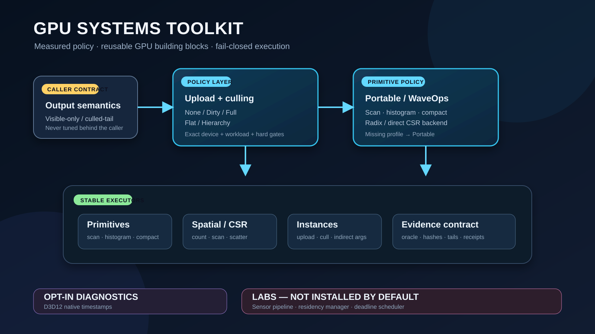

# GPU Systems Toolkit

Reusable Unity GPU building blocks, device-keyed policy, and reproducible
performance evidence extracted from a large real-time simulation codebase.

> **Portfolio preview — not an open-source release.** This repository is
> private and currently carries a proprietary license. Public redistribution,
> package publication, or reuse outside authorized private work requires a
> written rights decision or a clean-room reimplementation.



The project is deliberately narrower than “make every GPU workload faster.” It
provides forceable implementations, validates output before timing, selects
only from measured choices, and falls back when device/workload evidence is
missing or a tail-latency guardrail fails.

## What the stable toolkit contains

Install the neutral meta-package `com.yanagisawa.gpu-systems-toolkit@0.1.0`
to obtain the stable default surface:

| Layer | Legacy package ID | Responsibility |
|---|---|---|
| Core | `com.summit.gpu-primitives` | CommandBuffer-first scan, histogram, stable compaction, and radix sort with Portable/WaveOps backends. |
| Spatial | `com.summit.gpu-direct-binning` | Count → exclusive scan → scatter into a GPU-resident CSR index. |
| Spatial policy | `com.summit.gpu-adaptive-binning` | Forceable Direct/Radix implementations plus exact-cell measured selection. |
| Rendering | `com.summit.gpu-driven-instances` | Persistent full/dirty upload, multi-view visibility, grouping, CSR compaction, and indirect arguments. |
| Policy | `com.summit.gpu-autotuning` | Device fingerprints, holdout-accepted profiles, upload/culling selection, primitive composition, and fail-closed fallback. |

`com.summit.*` IDs and `Summit.*` namespaces remain as compatibility
identifiers. They do not import SUMMIT scenes, GIS data, buildings, imagery,
traffic, weather, or other application assets.

The following are intentionally opt-in:

- `com.summit.gpu-timestamps`: Windows/D3D12 diagnostics.
- `com.summit.gpu-sensor-pipeline`: experimental Lab.
- `com.summit.gpu-residency-manager`: experimental Lab.
- `com.summit.gpu-deadline-scheduler`: experimental Lab.

## Architecture contract

```text
caller-owned output semantics
        ↓
upload policy: None / Dirty / Full
        ↓
culling policy: Flat / Hierarchy
        ↓
independent primitive resolver: Portable / WaveOps
        ↓
forceable executor + correctness oracle + evidence receipt
```

- Output layout is a semantic constraint, never a hidden tuning axis.
- Upload/culling policy and primitive policy have separate evidence contracts.
- Unknown, stale, mismatched, or unvalidated profiles fall back to conservative
  execution.
- Forced candidates remain benchmarkable even when Auto rejects them, so a
  fallback cannot erase a negative result.

## Verified positive results

All numbers below are device-, workload-, scope-, and commit-specific. They
are not universal FPS or product-wide speedups.

| Mechanism | Frozen evidence | Result allowed for portfolio use |
|---|---|---|
| Wave scan / stable compaction | Unity 6000.5.2f1, D3D12, AMD Radeon AI PRO R9700 + NVIDIA RTX 4090 | Scan GPU scope `29.70% / 38.81%` lower; compaction `26.57% / 29.35%` lower (AMD / NVIDIA). |
| Visible-only instance scatter | RTX 4090, `1.05M × 4 views`, dispersed visibility | Classification/binning/indirect GPU scope `44.84%–93.13%` lower for `75%–5%` visibility; 100% control remained at parity. |
| Sparse dirty upload | RTX 4090, 10K/100K instances, 0/1/10% moving | Logical upload bytes `90%–100%` lower and CPU submission P95 `38.59%–96.13%` lower in the original sealed matrix. |
| Batched hierarchy | RTX 4090, `1.05M × 4 views`, 5/25/75/100% visibility | GPU mean `32.50%–53.41%` lower and GPU P95 `12.37%–16.26%` lower; frame/enqueue tail guardrails passed 4/4. |
| Adaptive CSR facade | RTX 4090, five unseen-seed holdout cells | Selected GPU average `45.69%–93.84%` lower and policy replay 5/5; strict per-pair tail gate was only 4/5 and is not claimed. |

Primary reports: [AMD primitives](Docs/GPU_PRIMITIVES_AMD_R9700_FORMAL_RESULTS_2026-07-30.md),
[NVIDIA primitives](Docs/GPU_PRIMITIVES_NVIDIA_RTX4090_FORMAL_RESULTS_2026-08-29.md),
[visible-only instances](Docs/GPU_DRIVEN_VISIBLE_ONLY_NVIDIA_RTX4090_FORMAL_2026-08-29.md),
[dirty upload](Docs/GPU_DRIVEN_INSTANCES_DIRTY_RANGE_UPLOAD_RTX4090_FORMAL_2026-08-30.md),
[hierarchy](Docs/GPU_DRIVEN_INSTANCES_HIERARCHY_BATCHED_RESERVATION_RTX4090_2026-08-31.md),
and [adaptive CSR](Docs/GPU_ADAPTIVE_BINNING_NVIDIA_RTX4090_FORMAL_2026-08-31.md).

## Negative and incomplete results are retained

| Result | Honest conclusion |
|---|---|
| WaveOps append | Counterbalanced 3-seed replay was negative and far below the practical gate; Auto keeps Portable. |
| Small `10K / 1 view / 1 group` GPU-driven system | A local fast path improved its forced-GPU scope, but the frozen engine-native system matrix still failed 2/4 GPU-tail cells; no “GPU always wins” claim. |
| Selected end-to-end internal formal | Stopped at 16/32 phases after a primitive-policy semantic defect was found; the defect was fixed, but the old artifact was not reused. No selected-system performance claim. |
| Official BRG Shooter adapter | Migration/build/correctness smoke ran, but image parity and native GPU timing coverage failed. Diagnostic timing is invalid for claims. |

See the experiment ledger and per-report limitations before quoting any number.
The official external sample work proves integration progress, not cross-project
performance portability.

## Installation

Requirements for the currently validated surface:

- Unity `6000.5.2f1` or newer within the `6000.5` line;
- Windows x64;
- Direct3D 12 for the validated GPU integration tests and native timestamps;
- PowerShell 7 for repository automation.

For local development:

```powershell
.\Tools\Install-GpuSystemsToolkit.ps1 `
  -ProjectRoot C:\path\to\UnityProject `
  -LocalRepositoryRoot $PWD
```

For a private commit-pinned Git install:

```powershell
.\Tools\Install-GpuSystemsToolkit.ps1 `
  -ProjectRoot C:\path\to\UnityProject `
  -Commit <full-40-character-commit>
```

The installer writes all sibling monorepo dependencies, sorts the manifest,
and emits a SHA-256 receipt. Installing only the meta-package Git URL cannot
resolve its sibling semantic-version dependencies until a scoped registry or
split repositories exist. Private-repository credentials are currently
required.

To remove every toolkit-owned dependency while preserving unrelated packages:

```powershell
.\Tools\Install-GpuSystemsToolkit.ps1 `
  -ProjectRoot C:\path\to\UnityProject `
  -Mode Uninstall
```

## Five-minute API quick start

1. Install the stable meta-package with the command above.
2. In Unity Package Manager, import **Policy Quick Start** from
   `GPU Systems Toolkit`.
3. Add `GpuSystemsPolicyQuickStart` to an empty GameObject and enter Play Mode.
4. Observe a validated synthetic candidate selection and a missing-profile
   fallback to `Portable`.

The sample intentionally uses fixed teaching data. It demonstrates the public
selection API and does not benchmark the current GPU.

## Visible preview

The side-by-side showcase renders the same procedural input through the
engine-native CPU reference and GPU-driven indirect path. It validates the two
offscreen image hashes before capturing the window, and labels itself
`PREVIEW ONLY — NOT FORMAL TIMING`.

```powershell
.\Tools\Run-GpuSystemsShowcase.ps1 `
  -EvidenceDirectory C:\path\to\showcase-evidence
```

The Player output is visual communication only. Formal runners remain
offscreen, counterbalanced, and free of preview UI work.

## Reproducing tests and measurements

```powershell
# Static package/application boundary
.\Tools\Test-RepositoryLayout.ps1

# Contract/provenance tests
Get-ChildItem .\Tools\Tests\Test-*.ps1 |
  ForEach-Object { pwsh -NoProfile -File $_.FullName }

# Full Unity API + GPU integration suite
.\Tools\Run-UnityEditModeTests.ps1 -UseGraphics -ForceDirect3D12
```

Benchmark design rules and runner entry points are in
[Docs/BENCHMARKS.md](Docs/BENCHMARKS.md). A result is invalid when correctness
or image hashes differ, timing coverage is incomplete, the scope changes,
ordering is not counterbalanced, or the exact source/device contract is absent.

## Repository map

- `Packages/`: reusable stable components plus opt-in Labs.
- `Assets/Gpu*Benchmark/`: procedural asset-free internal benchmark hosts.
- `ExternalBenchmarks/BRGShooter/`: lock, overlay, and preparation tools only;
  upstream Unity content is not vendored.
- `Integrations/NYCGIS/`: isolated private case-study snapshot; excluded from
  the stable package, quick start, external benchmark, and release surface.
- `Docs/` and `Evidence/`: methods, compact reports, limitations, and hashes.
- `Tools/`: deterministic install, test, build, run, selection, and summary
  scripts.

## FAQ

**Is this already an open-source Unity plugin?**
No. The package boundary is installable and tested, but the repository license
does not permit public reuse or redistribution.

**Does Auto benchmark the user’s GPU on every launch?**
No. Runtime resolution consumes exact-device, holdout-accepted profiles and
fails closed. Calibration and formal measurement are explicit workflows.

**Why keep negative results?**
They define selection boundaries. Append remains Portable, small instance
workloads may remain engine-native, dense upload selects Full, and small sparse
multi-view work can remain Flat.

**Are the large percentage improvements whole-frame speedups?**
No. Each row names its measured GPU or CPU scope. Whole-frame metrics are
reported separately when available.

**Can the NYCGIS integration be installed?**
Not from the stable meta-package. It depends on private host contracts and is
retained only as an isolated case study.

## License and contribution status

See [LICENSE.md](LICENSE.md), [NOTICE.md](NOTICE.md), and
[CONTRIBUTING.md](CONTRIBUTING.md). Until the rights gate is resolved, this is
a private portfolio engineering artifact rather than a public release.
