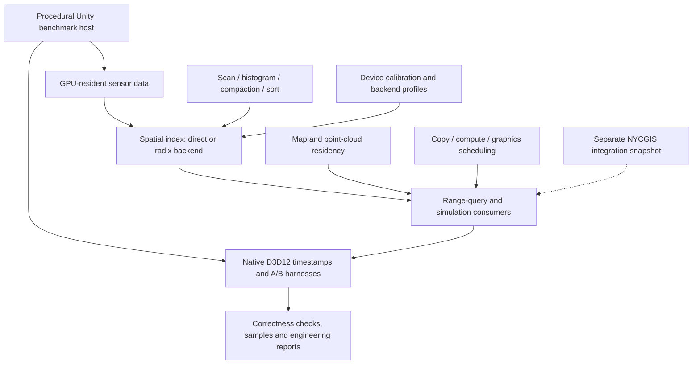
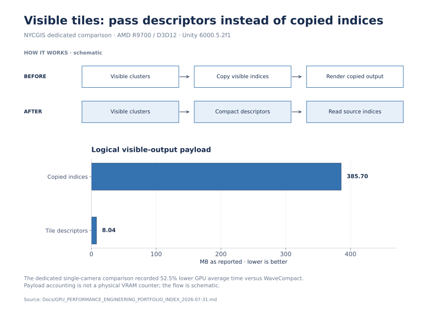

# SUMMIT GPU Systems

**Keep simulation data on the GPU and reduce the work between generation and use.**

Large real-time scenes spend GPU time moving and rebuilding data as well as
rendering it. I built reusable Unity packages for resident sensor data, spatial
indexing, scheduling and native timing, extracted from my personal SUMMIT project.

## Results

- **Logical visible output: approximately 385.7 MB → 8.04 MB** by replacing copied
  visible indices with compact tile descriptors in the NYCGIS integration.
- **52.5% lower GPU average time** in the dedicated single-camera comparison
  against WaveCompact using that no-copy path.

Recorded on AMD Radeon AI PRO R9700, D3D12 and Unity 6000.5.2f1. These numbers
describe the dedicated NYCGIS comparison; the standalone procedural benchmarks
provide separate, asset-independent reproduction paths.
[Results index and source reports](Docs/GPU_PERFORMANCE_ENGINEERING_PORTFOLIO_INDEX_2026-07-31.md).

## System architecture



The diagram groups responsibilities; it does not imply every package is enabled
in every benchmark. The NYCGIS snapshot requires its separate host contracts;
the procedural benchmarks are the asset-independent reproduction entry points.

## Visual walkthrough

[](Docs/portfolio/overview.png)

The before/after flow explains the change in representation, with the reported logical output sizes shown on a zero-based scale. [Sources and reproduction](Docs/portfolio/README.md).

## Engineering challenges

1. **Avoid paying for intermediate data repeatedly.** Producers, spatial indices
   and consumers need compatible GPU-resident representations and access patterns.
2. **Measure useful system work.** Native timestamps and controlled scene runs
   must distinguish algorithm time, synchronization and complete frame behavior.

## My contribution

I implemented the reusable GPU packages, native D3D12 timestamp integration,
deterministic A/B harnesses and benchmark automation, together with the isolated
NYCGIS integration snapshot. The package map below shows each subsystem's role.

## Evidence and reproduction

[Evidence index](Evidence/README.md) ·
[Procedural integration benchmark](PublicBenchmarks/UnityGpuIntegration/README.md) ·
[Quick start](#quick-start). The evaluation section retains the broader workload
results and follow-up investigations into complete-frame performance.

## Relationship to HLSL Kernel Pipeline

| Project | Engineering focus | Review entry point |
| --- | --- | --- |
| **SUMMIT GPU Systems** | Unity runtime composition: resident data, spatial queries, scheduling, residency and native instrumentation. | Packages below and the [procedural integration benchmark](PublicBenchmarks/UnityGpuIntegration/README.md). |
| [HLSL Kernel Pipeline](https://github.com/Yanagisawa2002/hlsl-kernel-pipeline) | Engine-neutral kernel execution, correctness, autotuning and device-specific profile emission. Unity is a profile consumer. | Its SDK, execution ABI and paired measurement reports. |

Both contain GPU primitives, but their system boundaries and measurements differ.
They are complementary portfolio projects, not evidence of an automatically
connected pipeline. A kernel-level speedup must not be substituted for a SUMMIT
scene-level or full-engine frame-time improvement.

## What is here

| Area | Package | Purpose |
| --- | --- | --- |
| GPU primitives | `com.summit.gpu-primitives` | CommandBuffer-first scan, histogram, stable compaction, and radix sort with portable and WaveOps backends. |
| Spatial binning | `com.summit.gpu-direct-binning` | Count → exclusive scan → scatter into a CSR spatial index. |
| Adaptive backend | `com.summit.gpu-adaptive-binning` | Device/workload-aware selection between direct and radix spatial backends. |
| Autotuning | `com.summit.gpu-autotuning` | Device fingerprints, calibration profiles, persistence, and backend resolution. |
| Sensor pipeline | `com.summit.gpu-sensor-pipeline` | GPU-resident sensor generation, packed SoA data, shared indexing, and range-query consumers. |
| Scheduling | `com.summit.gpu-deadline-scheduler` | Slack-aware copy/compute/graphics planning with a deterministic GPU workload. |
| Residency | `com.summit.gpu-residency-manager` | Virtual-page-to-physical-slot residency for large maps and point clouds. |
| Instrumentation | `com.summit.gpu-timestamps` | Nonblocking native D3D12 timestamp scopes integrated with Unity CommandBuffers. |

`Assets/Gpu*Benchmark` contains procedural, asset-free player builders and deterministic benchmark controllers for the packages. The benchmark scenes are generated temporarily during a build and are not checked in.

`Integrations/NYCGIS` contains the project-specific cluster renderer and showcase snapshot, including wave-level compaction, no-copy visible tiles, cluster-local 16-bit indices, sensor paths, and GPU vegetation. It is deliberately outside the root Unity `Assets` directory because it depends on types and data contracts owned by the SUMMIT/NYCGIS host project.

## Requirements

- Windows x64
- Unity `6000.5.2f1`
- Direct3D 12 for native timestamp measurements
- PowerShell 7 recommended
- Visual Studio C++ toolchain plus the Unity native plugin headers when rebuilding `SummitGpuTimestamps.dll`

## Quick start

1. Clone the repository and open its root as a Unity project.
2. Let Unity resolve the embedded packages and compile the benchmark assemblies.
3. Run the repository checks:

   ```powershell
   .\Tools\Test-RepositoryLayout.ps1
   .\Tools\Run-UnityEditModeTests.ps1
   .\Tools\Run-UnityEditModeTests.ps1 -UseGraphics -ForceDirect3D12
   ```

4. Run a benchmark, for example:

   ```powershell
   .\Tools\Run-GpuPrimitiveBenchmark.ps1
   .\Tools\Run-GpuDirectBinningBenchmark.ps1
   .\Tools\Run-GpuSensorPipelineBenchmark.ps1
   ```

Use `Get-Help <script> -Detailed` or inspect the parameter block for workload matrices, repetitions, output paths, and build reuse switches.

## Consuming a package from another Unity project

During local development, add an embedded package with a `file:` dependency. After pushing a tag, a consumer can reference a package subdirectory with a Git UPM URL, for example:

```json
{
  "com.summit.gpu-primitives": "https://github.com/Yanagisawa2002/summit-gpu-systems.git?path=/Packages/com.summit.gpu-primitives#v0.1.0"
}
```

Packages with internal dependencies require the corresponding `com.summit.*` dependencies to be added to the consumer manifest as well. Public repository access does not require credentials. The [limited benchmark reproduction permission](LICENSE.md#limited-benchmark-reproduction-permission) allows benchmark execution, local reproduction changes, and publication of measurement results. Other plugin rights remain reserved; this is not an open-source license.

## Repository policy

- Portable packages and benchmark harnesses must not reference NYCGIS, BFP2, FishNet, city datasets, or asset paths outside their own generated benchmark folders.
- Project-specific adapters remain under `Integrations/` until their host contracts are generalized.
- Generated players, Unity caches, raw captures, screenshots, and large datasets stay out of Git.
- Performance claims require deterministic workloads, correctness hashes/oracles, counterbalanced ordering, native GPU timestamps where applicable, and documented hardware/driver context.

See [`MIGRATION_MANIFEST.md`](MIGRATION_MANIFEST.md) for provenance and exclusions.

<details>
<summary>Evaluation details, tradeoffs and supported scope</summary>

## Validated results

The subsequent [capacity replay](Docs/CausalIndexCosts.md) rejects the single empty-cell-reservation candidate before GPU testing: streaming still rebuilds every update and logical consumer work increases. The [probe-control diagnosis](PublicBenchmarks/UnityGpuIntegration/RESULTS-causal-costs-2026-09-08.md) reproduces long Present waits and missing engine GPU values with no native probes. Required synchronization and runtime defaults remain unchanged; there is no new stable frame-performance claim.

The focused follow-up [diagnoses index costs](Docs/FocusedIndexCosts.md) and [repairs scene timing collection](PublicBenchmarks/UnityGpuIntegration/RESULTS-focused-costs-2026-09-08.md). Reserved-layout query cost and capacity fallback explain the measured incremental-path limits; the measured hotspot/CellSerial and streaming/BatchedPointScanWave trajectories are not recommended for that path. Query and index choices remain opt-in. Complete engine GPU coverage and stable engine-cadence gains remain unresolved; unsupported allocation counters now report unavailable instead of zero.

The September 8 unified comparison adds a [standalone procedural Unity scene](PublicBenchmarks/UnityGpuIntegration/README.md) covering spatial queries, dynamic index updates, rendering and actual AssetBundle loading. Its [fixed-matrix results](PublicBenchmarks/UnityGpuIntegration/RESULTS-2026-09-08.md) confirm narrow query/explicit-scene GPU improvements, while stable engine-frame cadence remains inconclusive and full-engine GPU coverage is insufficient. The [matching microbenchmark report](Docs/UnifiedMicrobenchmarkResults.md) retains all failed stability gates and the absence of a confirmed complete-GPU incremental-index benefit. Both new runtime paths remain opt-in.

The retained measurements were collected on AMD Radeon AI PRO R9700, Direct3D 12, and Unity `6000.5.2f1`. NVIDIA validation has not been performed and is not claimed.

- Native GPU primitives: wave exclusive scan `+29.70%`, radix sort `+16.82%`, stable compaction `+26.57%`; `29,700/29,700` native timestamp samples valid.
- GPU-resident sensor pipeline: GPU average improved `85.99%–89.66%` and GPU P99 improved `82.85%–87.81%` across the two retained workloads, with `8/8` wins.
- NYCGIS wave64 cluster compaction: returned atomic reservations reduced by at least `98.19%`; four-camera GPU average improved `2.28%` and GPU P99 improved `6.69%`.
- NYCGIS no-copy visible tiles: compact output reduced from approximately `385.7 MB` of visible indices to `8.04 MB` of descriptors. The dedicated single-camera comparison improved GPU average/P99 by `52.5%/51.9%` relative to WaveCompact.

These results are workload-specific, not universal performance guarantees. Definitions, validation gates, counterbalancing, and caveats are retained in [`Docs`](Docs/) and [`Evidence/README.md`](Evidence/README.md).

</details>
